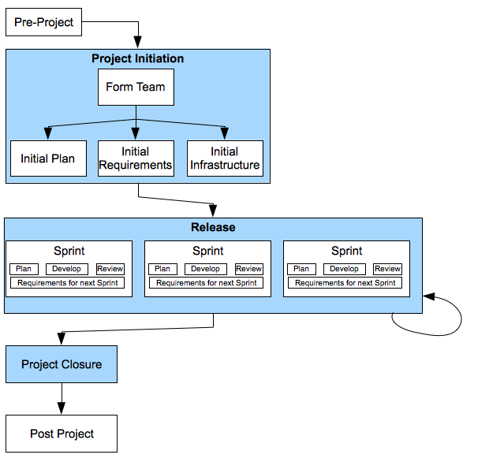

[two](2.html)

# Domain7 Custom Development Lifecycle

## Overview

This document presents a DRAFT Custom Development Lifecycle / Framework for implementation at Domain7.  It is generally understood that Domain7 would benefit from adopting a more standardized and supported custom development approach.  This approach should extend consistently from initial business development / sales activities, through proposal preparation, project execution, and transition to support. 

The figure to the left represents a draft Custom Development Lifecycle for Domain7.  The subsequent pages provide further details on each box in this lifecycle (the box being described on each page is highlighted in red).