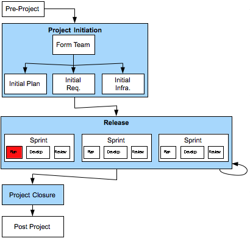

[9](9.html) 10 [11](11.html)

# Domain7 Custom Development Lifecycle

## Release > Sprint > Plan

### Description

This activity creates a “Sprint Plan” based on input from the entire team.  A Sprint Planning Meeting is held, where the Product Owner outlines the goal for the Sprint and the team members estimate the work involved.

### Deliverables

### Primary Roles 
* Agile Project Manager
* TBD
