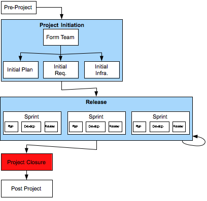

[12](12.html) 13 [14](14.html)

# Domain7 Custom Development Lifecycle

## Project Closure

### Description

Project Closure includes handing the project over to the operations support team, tidying up final loose ends (including administrative closure), reviewing the project,  and celebrating project completion.

Specific considerations include:
* Working code, build scripts, and test suites should be made available as needed for ongoing operational support.
* Unneeded environments should be decommissioned.
* Final invoices should be prepared as required.
* A retrospective “lessons learned” should be conducted, with results available for other projects to use in the future.

### Deliverables

* Materials provided to Operational Support Team
* Training provided to Operational Support Team
* Lessons Learned Document
* Potential User Stories for subsequent project (optional)

### Primary Roles 

* Agile Project Manager
* TBD
