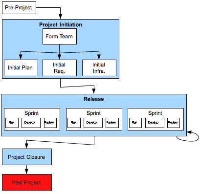

[13](13.html) 14 



## Post-Project

### Description

Post-Project is focused not on the project per-se, but on the product that results.  It includes checking some time after the project completion (eg. 3 – 6 months) as to whether the product meets the business need for which it was created. 

### Deliverables

### Primary Roles 

* Account Manager
