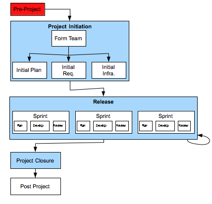

[one](1.html) [three](3.html)

# Domain7 Custom Development Lifecycle

## Pre-Project

### Description

Conducted before the project actually starts, the primary purpose is to justify doing the project (i.e. establish and articulate the reason for doing the project)

### Deliverables

Project Brief (Project Vision):  documents the purpose or vision for the project, and why it justifies spending money on it.  Recommended that it includes information on the following:

1.  what problem will the problem solve?
2.  for whom will it solve this problem?
3.  how will success be measured?
4.  what alternatives exist?
5.  why now?
6.  how will solution be deployed?
7.  preliminary estimated cost or budget?
8.  what are critical success factors?

Low Fidelity Prototype (optional):  paper based, or extremely high-level click through prototype of system.

### Primary Roles 

* Business Owner:  Responsible

* Pre-Project deliverables may be produced by the client and provided as part of a Request for Proposal.  Alternatively, the client may engage Domain7 to assist in conducting the work in the Pre-Project phase.
