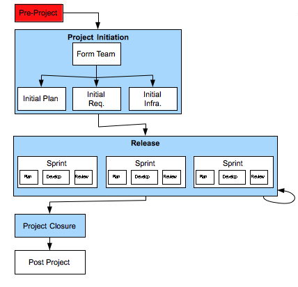

[one](1.html) [three](3.html)

# Domain7 Custom Development Lifecycle

## Project Initiation

### Description

Includes all of the work necessary before full scale coding begins, and includes the following steps:

1.  Find / Write Project Brief (if wasn't handed off from Pre-Project)
2.  Form Team
3.  Initial Plan
4.  Initial Requirements
5.  Initial Infrastructure

Note that this phase should be short in duration, and involve the actual project team.  Deliverables will not be “perfect” or “final” at this point – they should be at the minimum point required to start developing the solution.

### Deliverables

Project Brief (Project Vision):  produced at this point if wasn't produced in “Pre-Project” phase.  See description in “Pre-Project”.

All other deliverables for Project Initiation will be described under Form Team, Initial Plan, Initial Requirements and Initial Infrastructure.

### Primary Roles 

* Agile Project Manager
* TBD
