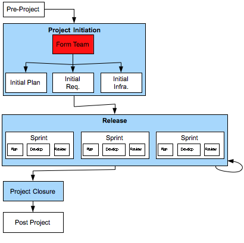

[3](3.html) 4 [5](5.html)

# Domain7 Custom Development Lifecycle

## Project Initiation > Form Team

### Description

The Project Manager mobilizes the Project Team and makes sure they have appropriate work space.  The team should contain all skills required to deliver the product, including Project Manager, Product Owner, Designers, Developers, and Testers.

Physical co-location is strongly recommended for the team.

### Deliverables

Mobilised project team, including:

1.  identification and arrangement of any training required.
2.  recurring meetings established and scheduled.
3.  team is co-located if possible
4.  ensure team has full access to project materials, and has reviewed them.

### Primary Roles 
* Agile Project Manager
* TBD
