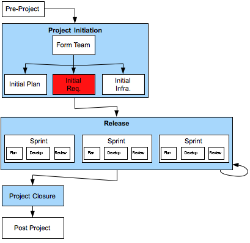

[5](5.html) 6 [7](7.html)



## Project Initiation > Initial Requirements

### Description
The Product Owner is responsible for delivering initial requirements, which includes:

1.  High-level Requirements for entire project, and
2.  Detailed Requirements for Timebox 1 (and possible 2).

Requirements are generally gathered through facilitated workshops with stakeholders.

Requirements should include visual and user experience considerations as well as functional requirements.
Deliverables

### Deliverables

* High-Level Requirements for entire project:  these are generally in the form of User Stories.
* Detailed Requirements for Timebox 1:  these are generally in the form of Feature Files.
* Detailed Requirements for Timebox 2 (optional)
* High-Fidelity Prototype (optional)

### Primary Roles 

* Agile Project Manager
* TBD
