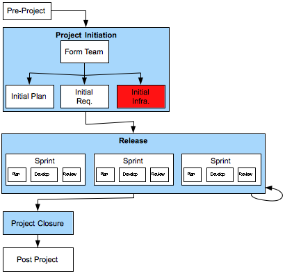

[6](6.html) 7 [8](8.html)

# Domain7 Custom Development Lifecycle

## Project Initiation > Initial Infrastructure

### Description
Technical team members set up the required infrastructure for the project, including:

1. Environments:
    * Developer and test machines
    * Servers
    * Bug tracker, etc...

2.  Version Control and Builds
    * Source code repository
    * Continuous integration tools

3.  Test Driven Development Frameworks
    * Tools for automated testing
    * Enough code to support automated build, continuous integration and automated test framework in use.

There is also basic documentation prepared outlining the basic hardware and software of the intended solution, the intended target platform, and major components of the solution.  An initial data model may be prepared at this point as well.

### Deliverables

* Technical environments established
* Version Control and Builds infrastructure and process established
* Test Frameworks established.

### Primary Roles 

* Agile Project Manager
* TBD

