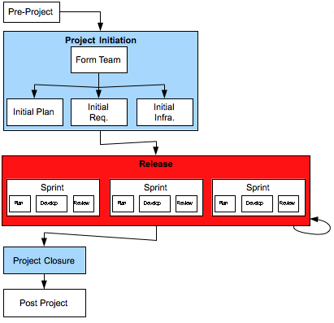

[7](7.html) 8 [9](9.html)

# Domain7 Custom Development Lifecycle

## Release

### Description

A Release is a piece of development ending in a launch, and is comprised of one or more sprints.

A project may have one or more releases, as described in the Release Plan.

### Deliverables
* Launch of functionality

### Primary Roles 
* Agile Project Manager
* TBD
