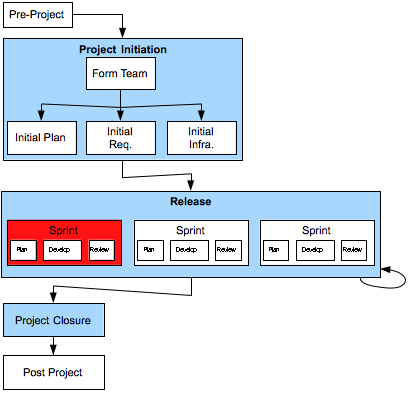

[8](8.html) 9 [10](10.html)

# Domain7 Custom Development Lifecycle

## Release > Sprint

### Description

### Deliverables

A Sprint is generally a few weeks in duration, with a fixed delivery (or completion) date.

A Sprint is comprised of  “Plan”, Develop” and “Review” activities.  The outcome of the “Review” activity is scheduled into later Sprints.

### Primary Roles 

* Agile Project Manager
* TBD
